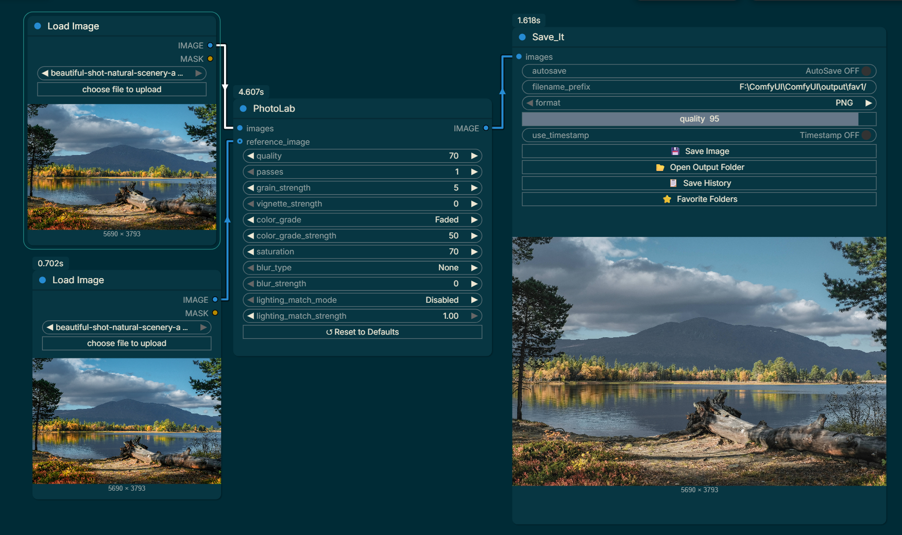

# PhotoLab
### ComfyUI node that applies effects to generated images like JPG compression, color grading, film grain, vignette, blur, and optional lighting matching with a reference image.

### Features:
- **JPG Compression Artifacts**: Simulate digital compression degradation with adjustable quality and multiple passes
- **Film Grain**: Add realistic film grain noise with controllable strength
- **Vignette**: Apply darkening around image edges
- **Color Grading**: Choose from presets (None, Warm, Cool, Faded, Sepia) with adjustable strength
- **Saturation Control**: Adjust color saturation from grayscale to boosted
- **Blur Effects**: Multiple blur types including Gaussian, Box, Motion (horizontal/vertical), Radial, Lens, and Soft Focus
- **Lighting Matching**: Match lighting and shadows from a reference image using advanced algorithms (Histogram L-channel, Reinhard Transfer, Full LAB Histogram)

### Effects:
- **quality**: JPG compression quality (0-100, lower = more artifacts)
- **passes**: Number of compression passes (1-10, more = more degradation)
- **grain_strength**: Strength of grain effect (0-100, 0 = disabled)
- **vignette_strength**: Strength of vignette effect (0-100, 0 = disabled)
- **color_grade**: Color grading preset ("None", "Warm", "Cool", "Faded", "Sepia")
- **color_grade_strength**: Strength of color grade effect (0-100)
- **saturation**: Color saturation (0-200, 100 = original)
- **blur_type**: Type of blur ("None", "Gaussian", "Box", "Motion Horizontal", "Motion Vertical", "Radial", "Lens", "Soft Focus")
- **blur_strength**: Strength of blur effect (0-100, 0 = disabled)
- **lighting_match_mode**: Algorithm for lighting transfer ("Disabled", "Histogram (L-channel)", "Reinhard Transfer", "Full LAB Histogram")
- **lighting_match_strength**: Blend strength for lighting match (0.0-1.0)

### Optional Parameters:
- **reference_image**: Reference image tensor [B, H, W, C] for lighting matching (only used when lighting_match_mode is not "Disabled")
- **Reset to Defaults** Resets all parameters to their defults

Credit to: https://github.com/brucew4yn3rp/ComfyUI_VintageEffect.git
